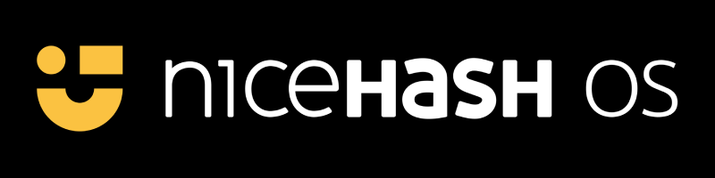
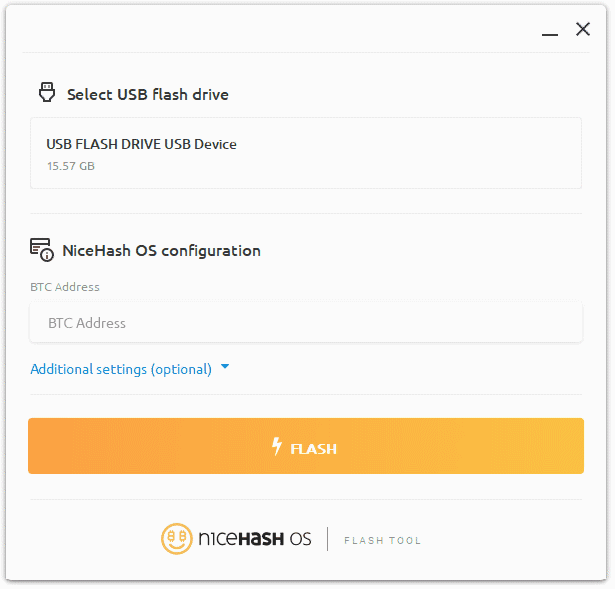

# NiceHash OS
**NiceHash OS** is a minimal standalone **Linux** operating system containing everything you need to start mining crypto-currency efficiently.

# NiceHash OS bootable flash drive
To create NiceHash OS bootable flash drive you will first need to download **NiceHash OS image** (an `.img.gz` file), and then use **special application that writes an image to a USB drive**. You cannot simply copy the image file to a USB drive, you must use special software to write it properly.

**Note**
For creating NiceHash OS flash drive, you will need elevated privileges on your system (administrator privileges on Windows and root privileges on macOS or Linux).

**Warning**
The process described below will delete any data currently on your flash drive. Make sure to back up your flash drive's data to another storage location before proceeding.

## Using NiceHash Flash Tool
[**NiceHash Flash Tool**](https://github.com/nicehash/NHOS-Flash-Tool) tool not only provides cross-platform image burning capabilities, but it is also extremely easy to use. There is no need to download the NiceHash OS image beforehand, this tool will do this for you.

## Using other tools
When using tools other than **NiceHash Flash Tool**, you need to download **the latest NiceHash OS image** from our website beforehand and then write it to a USB drive using [balenaEtcher](https://etcher.io) or any other similar tool.

**Note**
When using tools other than NiceHash Flash Tool to flash the image to the flash drive, you need to manually adjust the configuration file adding **your mining address at a minimum**.

**Note**
If you prefer to use command line tools instead, there are three simple steps to write an image file using `dd` tool
1. Decompress NiceHash OS image file
   `gunzip nhos-x.x.x.img.gz`
    
2. Define output device to write an image file to
   `/dev/sda`
    
3. Start image writing process
   `dd if=nhos-x.x.x.img of=/dev/sda bs=4M && sync`
    

**Warning**
Be careful defining output device, wrong usage of the `dd` tool can lead to **irreversible damage to your system**!

### Finish
At this point, you should have everything prepared to start using NiceHash OS. All you need to do now is to **plug NiceHash OS flash drive into your mining machine and turn it on!**
